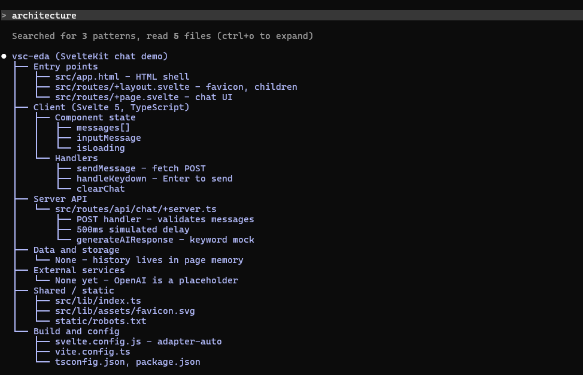

# architecture-tree

A [Claude Code](https://claude.com/claude-code) plugin that watches for architecture or design talk in your prompts and asks Claude to answer with a box-drawing tree of the system, alongside its normal reply.

**Version:** 0.1.0

## What it does

The plugin hooks into `prompt.submit`. When you type a prompt that reads like a question about architecture or design, it:

1. Shows a toast: `Architecture words found: asking for a mindmap`.
2. Silently attaches a hidden instruction to the prompt (via the event's `context`), telling Claude to also read the repository and produce the system architecture as a box-drawing tree in a code block, plus a couple of sentences of notes.

Your typed prompt text is left exactly as you wrote it — only Claude's instructions are extended.

This only applies to prompts a person actually typed (or sent via an app/SDK). Messages relayed from a plugin, a peer, or a notification pass through untouched.

## Trigger words

The plugin matches on two kinds of language (see [hooks/register.ts](hooks/register.ts)):

- **Architecture words**, which trigger on their own: `architecture`, `architectural`, `architect`, `system overview`, `component diagram`, `high-level structure`, `tech stack`, `microservice`, `monolith`, `data flow`, `codebase structure`, `project structure`, `module structure`, and phrasings like "how is this structured/organized".
- **"design" paired with a software word**, since "design" alone is ambiguous (it's also a UI/graphic/fashion word). It counts when next to words like `system`, `api`, `database`, `schema`, `service`, `module`, `pattern`, `infra`, `tech`, `app`, in either order — e.g. "database design", "design patterns", "design the architecture".

### Opting out

If your prompt says things like "no diagram", "without a mindmap", "skip mermaid", or "don't do a diagram", the plugin leaves it alone even if it otherwise matches. The opt-out only recognizes `diagram`, `mindmap`, `mind map`, and `mermaid` (see `OPT_OUT` in [hooks/register.ts](hooks/register.ts)), so a phrase like "skip the tree" will not opt out.

## Example output

When triggered, Claude's answer includes a tree shaped like this:

```
my-app
├── Entry points
│   ├── src/server.ts
│   └── src/cli.ts
├── Core modules
│   ├── router
│   └── services
└── Data and storage
    ├── Postgres
    └── Redis cache
```

The tree is plain text, so it reads directly in the terminal with no viewer. Claude is instructed to read the actual repo first, so nodes name real entry points, modules, and infrastructure rather than invented ones — guesses are called out as assumptions.

## Screenshots

Typing `architecture` triggers the plugin: Claude reads the repo and answers with a tree of the real project structure. The screenshot below was taken before the switch from Mermaid, so its diagram is in the old Mermaid format.



More screenshots and GIFs live in [screenshots/](screenshots/).

## Project structure

```
architecture-tree/
├── .claude-plugin/
│   └── plugin.json       # plugin manifest: name, version, description
├── hooks/
│   ├── hooks.json        # registers register.ts as the hooks module
│   ├── register.ts       # prompt.submit hook: detection + instruction injection
│   └── register.test.ts  # unit tests for register.ts
├── screenshots/          # screenshots/GIFs referenced from this README
└── tsconfig.json
```

## Installation

This is a Claude Code plugin with no runtime dependencies — there's no build step or `npm install`. Place this folder wherever Claude Code loads plugins/mods from, and the engine picks up `hooks/hooks.json` automatically.

## Usage

Once installed, there's nothing to configure or invoke — the plugin runs automatically on every prompt you type.

1. Open a Claude Code session in any project.
2. Type a prompt that mentions architecture or design, e.g.:
   - `architecture`
   - `give me a system overview`
   - `what's the tech stack here?`
   - `explain the database design`
3. The plugin shows the `Architecture words found: asking for a mindmap` toast and Claude's reply includes a box-drawing tree of the project alongside its normal answer (see [Example output](#example-output) and the [screenshot](#screenshots) above).
4. To get a plain answer without the diagram, add an opt-out phrase, e.g. `architecture overview, no diagram`.

## Development

- Validate the plugin: `claude plugin validate <dir>`
- Run the test suite: `claude plugin test <dir>`

Tests for the detection logic and instruction text live in [hooks/register.test.ts](hooks/register.test.ts).
